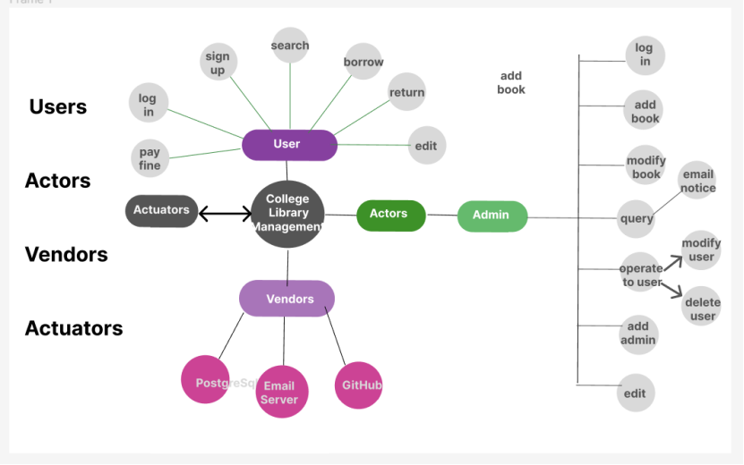

# AppDev-Project-YaoWu-ZhengXue
College Library Management System
1. Project Title
College Library Management System
2. Project Scope
Features of the Selected Project:
The College Library Management System is designed to offer a comprehensive set of features catering to two distinct user roles: Users and Administrators.

Main User Functions:
Log In: Users and Administrators can securely log in to access their respective functionalities.
Sign Up: New users can easily create accounts with the system, providing necessary personal details for authentication.
Book Information Management: Users can search for books, query detailed book information, borrow books, return books, and receive overdue email reminders to ensure timely returns. Administrators, in addition to these functions, can perform new book entries, modify book information, and remove books from the library catalog.
Modification of Personal Information: Both Users and Administrators can update their personal information as needed to maintain accurate records.

Admin Functions:
Add Deputy Admin: Administrators have the authority to add deputy administrators to assist in managing the library system effectively.
Overdue Book Management: The system automatically sends reminders to users' email addresses when books are overdue. Additionally, it calculates fines for overdue books. Users can return books even if they are overdue, but they must pay the fine before borrowing additional books.
Personal Information Management: Administrators can manage their own personal information within the system.
Integration of End Users with the Project:
The integration of end users, both regular Users and Administrators, is achieved through user-friendly interfaces and functionalities:
User-Friendly Authentication: A secure and user-friendly authentication system ensures that both Users and Administrators can log in and access their roles effortlessly.
Efficient Book Management: Users can search, borrow, and return books with ease. They receive timely reminders for overdue books. Administrators can perform extensive book management tasks, including adding new books, modifying book information, and removing outdated materials.
Personal Information Updates: Both Users and Administrators can maintain up-to-date personal information, ensuring the accuracy of user records within the system.

Areas Covered with This Project:

The College Library Management System project comprehensively addresses multiple facets of library management:
User Management: The system efficiently manages user accounts, ensuring secure logins for Users and Administrators.
Book Cataloging and Management: The project encompasses the creation, modification, and removal of book records in the library catalog, ensuring a well-maintained and up-to-date collection.
Overdue Book Management: The system automates the process of sending email reminders for overdue books and calculates fines for overdue items, contributing to efficient library operations.
Personal Information Management: Both Users and Administrators can update their personal information as needed, ensuring accurate records within the system.

3. Project Users, Actors, Vendors, Actuators
Beneficiaries (Users):
Regular Users: Students and faculty members benefit from easy access to library resources. They can search for books, borrow and return items, and receive overdue reminders to facilitate a seamless library experience.
Administrators: Librarians and library staff have powerful tools at their disposal to manage library operations efficiently. They can add deputy administrators, maintain accurate book records, manage overdue book notifications, and update their personal information within the system.
Third-Party Actors or Companies:
Email Service Provider: The system integrates with an email service provider to send overdue book reminders to users, enhancing communication and encouraging timely returns.

4. Project Properties
Development Platforms and Software Applications:
Development Platform: We will develop our system using Microsoft Visual Studio.
Programming Language: Our primary programming language will be C#.
Database Management: We will utilize PostgreSQL for robust data storage and management.
User Interface: The user interface will be built using Windows Presentation Foundation (WPF) to provide a modern and intuitive experience.
Version Control: We will use Git and github for version control to facilitate collaborative development and code management.

5. Plan Details
Work Plan:
Week 1-2 (Requirements Gathering and Project Planning): During the initial two weeks, our team will focus on understanding project requirements, defining user stories, and creating a detailed project plan.
	Week 3-4 (Database Design and Setup): In the third and fourth weeks, we will design the database schema and set up the database.
	Week 5-6 (User Authentication and User Interface Development): We will work on user authentication mechanisms and begin developing the user interface.
Week 7-8 (Core Functionality Implementation): Weeks seven and eight will be dedicated to implementing core functionalities such as cataloging, loan tracking, and notifications.
Week 9 (Testing and Bug Fixing): The ninth week will involve rigorous testing and bug fixing to ensure a stable system.
Week 10 (Final Testing, Documentation, and Presentation Preparation): In the final week, we will conduct comprehensive testing, complete project documentation, and prepare for the project presentation.
